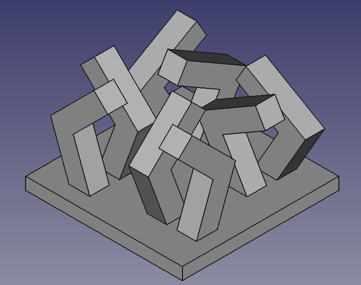
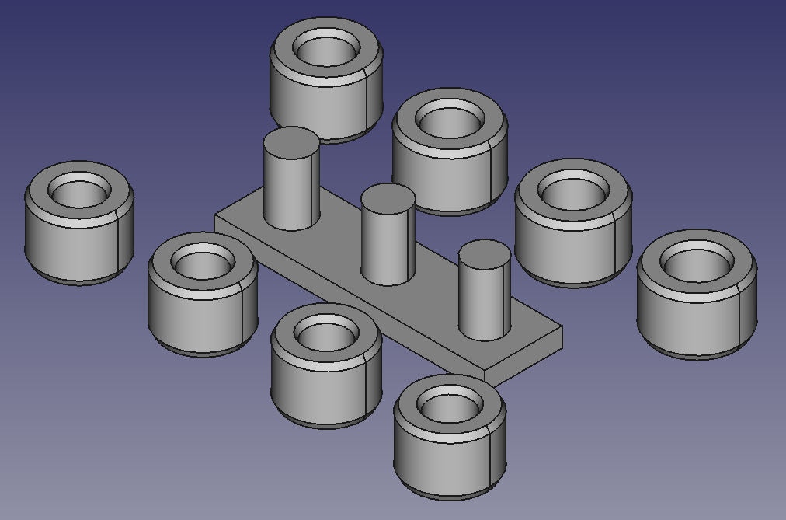
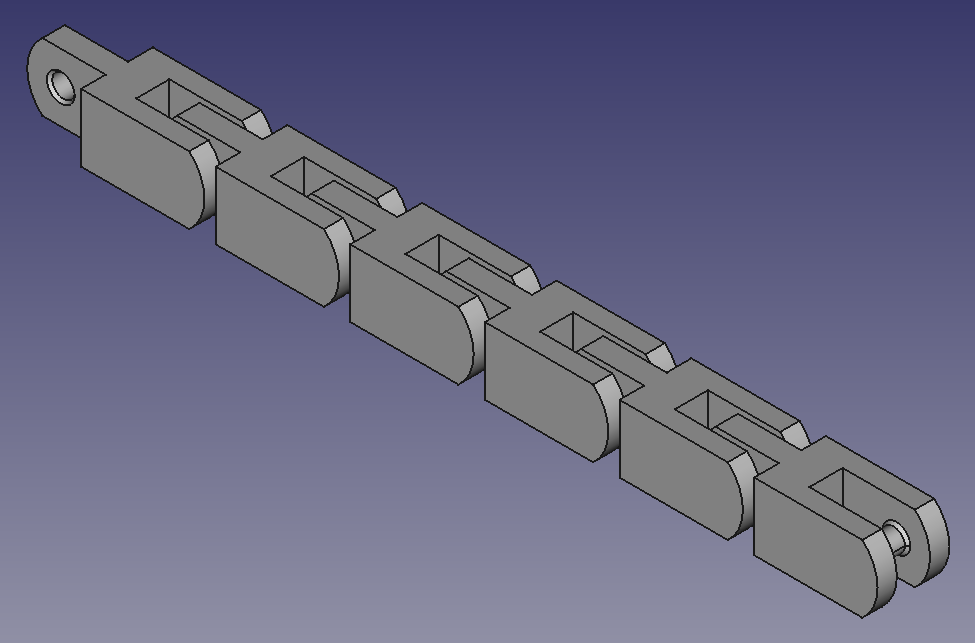
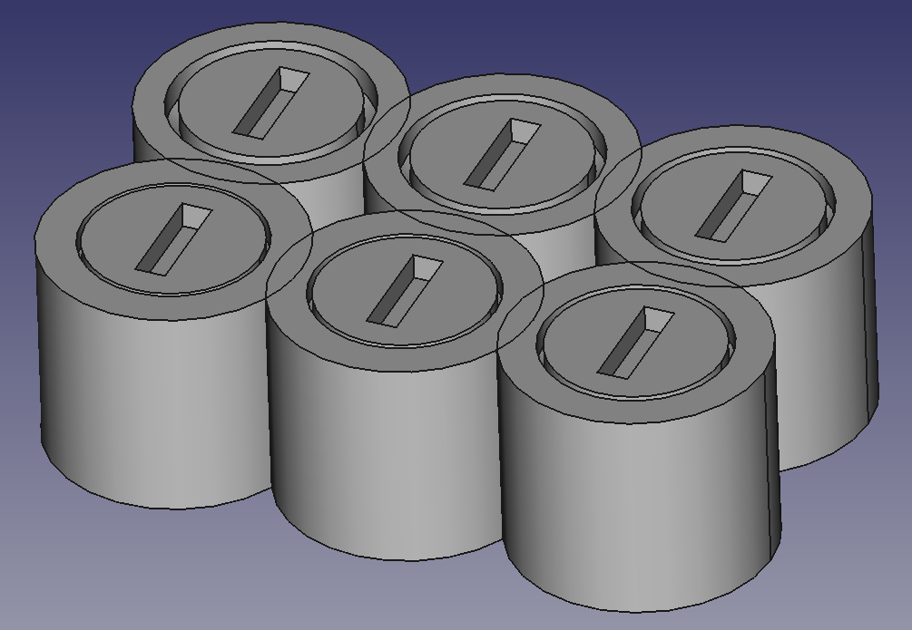
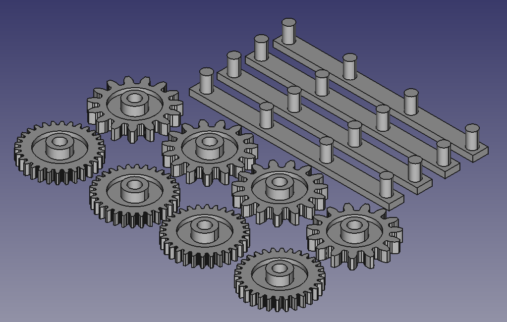
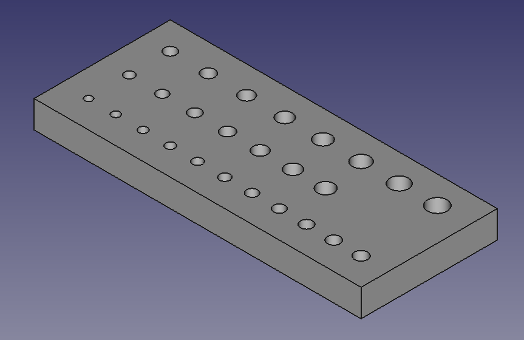

# Chris's 3D Printing Tests

These are various 3d printing test structures I've put together. They're
under CC-BY-SA, so by all means use them and share them.

Specific test structures:

* `angle-test` -- Overhangs 20, 30, 45, and 60 degrees off-vertical.
* `axle-test` -- Separately printed rings and vertical posts to test axle
clearance.
* `chain-test` -- Print-in-place chain to test horizontal axle PIP clearance.
* `clearance-test` -- Print-in-place spools to test vertical axle PIP
clearance.
* `gear-test` -- Gears and vertical posts to test gear-to-gear spacing
clearances.
* `screw-test` -- Tapping holes and clearance holes for #2, #4, and #6
machine screws. For clearance, use the smallest hole the screw will fit
through; for tapping, the largest hole the tap fully engages with.

## Gallery

_This is the end of the file._
